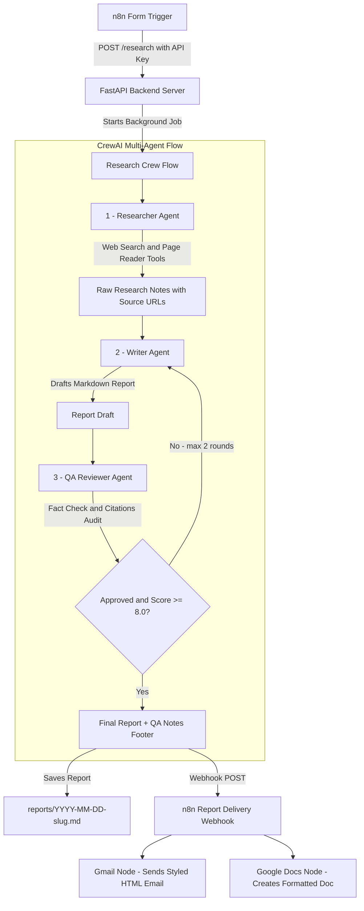

# 🤖 Multi-Agent Research & Report Crew

[](https://github.com/ansawan/multi-agent-research-crew/actions/workflows/tests.yml)


[](LICENSE)

A production-ready **CrewAI Multi-Agent System** that turns a research brief into a comprehensive, source-backed executive report. Triggered seamlessly from an **n8n Form**, orchestrated by three specialized AI agents powered by **Google Gemini**, and delivered directly to your inbox via **Gmail** and **Google Docs**.

---

## 🏗️ System Architecture



---

## 🌟 Features & Highlights

- **3 Autonomous CrewAI Agents**:
  - **Researcher Agent**: Plans 4-6 web queries, searches (Tavily / DuckDuckGo), reads web pages (`trafilatura`/`BeautifulSoup`), extracts facts with exact source URLs.
  - **Writer Agent**: Synthesizes notes into a structured report (Title, 5-bullet Executive Summary, Key Findings, Comparison Table, Opportunities & Risks, Recommendations, Sources list, inline citations `[1]`, `[2]`).
  - **QA Reviewer Agent**: Fact-checks claims against raw notes, validates citations, enforces brief compliance, outputs Pydantic structured verdict (`score`, `approved`, `issues`, `required_fixes`).
- **Autonomous Revision Loop**: Triggers automatic writer revisions if QA score is below 8.0/10 (up to 2 rounds).
- **Dual Interface**:
  - **FastAPI REST Server**: Async background execution with status tracking (`/research`, `/status/{id}`, `/report/{id}`).
  - **CLI Runner**: Interactive CLI for terminal testing (`python run.py "Topic"`).
- **Automated n8n Integration**: Ready-to-import n8n workflows for Form trigger and Gmail / Google Docs delivery.
- **Robust Error Handling**: Exponential backoff retries for Gemini API rate limits with bilingual messages (Roman Urdu + English).

---

## ⚙️ Prerequisites & Python Version Compatibility

- **Python**: Compatible with **Python 3.10 – 3.13** *(Tested and verified on Python 3.12.10)*.
- **Node.js & n8n** (Optional for n8n automation): Node v18+ with `npx`.

---

## 🚀 Quick Setup Instructions

### 1. Clone & Setup Virtual Environment
```powershell
# Clone the repository
git clone https://github.com/ansawan/multi-agent-research-crew.git
cd multi-agent-research-crew

# Create virtual environment
python -m venv venv

# Activate virtual environment
.\venv\Scripts\activate
```

### 2. Install Dependencies
```powershell
pip install --upgrade pip setuptools wheel
pip install -r requirements.txt
```

### 3. Configure Environment Variables (`.env`)
Copy `.env.example` to `.env`:
```powershell
copy .env.example .env
```
Open `.env` and fill in your keys:
- **`GEMINI_API_KEY`**: Obtain from [Google AI Studio](https://aistudio.google.com/apikey). *(Required)*
- **`API_KEY`**: Secret key for protecting API endpoints (use a long random string). *(Required)*
- **`TAVILY_API_KEY`**: Optional search key from [Tavily](https://tavily.com). If left blank, falls back to free DuckDuckGo search.
- **`N8N_DELIVERY_WEBHOOK_URL`**: Webhook URL from n8n (e.g. `http://localhost:5678/webhook/report-delivery`).

---

## 💻 How to Run

### Option A: Run via CLI (Quick Terminal Test)
```powershell
.\venv\Scripts\python.exe run.py "AI chatbots for dental clinics in Pakistan" --type "Market research" --audience "Dentists & Clinic Owners" --depth "Quick ~2 pages"
```

### Option B: Start FastAPI Web Server
```powershell
.\venv\Scripts\python.exe run.py --server
```
*API will run at: `http://localhost:8000` (Interactive API Docs at `http://localhost:8000/docs`).*

---

## 📡 API Endpoints Summary

| Endpoint | Method | Security | Description |
| :--- | :--- | :--- | :--- |
| `/research` | `POST` | `X-API-Key` | Submits research brief, starts background crew job, returns `job_id`. |
| `/status/{job_id}` | `GET` | `X-API-Key` | Checks current stage (`researching`, `writing`, `reviewing`, `revising`, `done`), progress messages, and QA score. |
| `/report/{job_id}` | `GET` | `X-API-Key` | Retrieves completed Markdown report, rendered HTML, and source links. |
| `/report/{job_id}/view` | `GET` | None | Renders final HTML report directly in web browser. |

---

## 🧪 Running Tests

The test suite covers QA verdict parsing, source extraction, HTML rendering, and API authentication and job flow. It does not call Gemini or the web, so no API keys are needed.

```powershell
.env\Scripts\python.exe -m pytest -q
```

Tests also run automatically on every push via GitHub Actions.

---

## 🔗 n8n Workflow Integration

Import the JSON files located in `/n8n`:
1. **`n8n/research_request_workflow.json`**: Creates an n8n Form trigger for submitting research requests.
2. **`n8n/report_delivery_workflow.json`**: Receives completed reports from the backend and delivers them via **Gmail** and **Google Docs**.

*See [n8n/README.md](n8n/README.md) for step-by-step setup instructions.*

---

## 📄 Sample Output

An **illustrative** sample report (mock data and placeholder sources, showing the output format) is available at [`examples/sample_report.md`](examples/sample_report.md).

---

## 📜 License

Released under the [MIT License](LICENSE).
